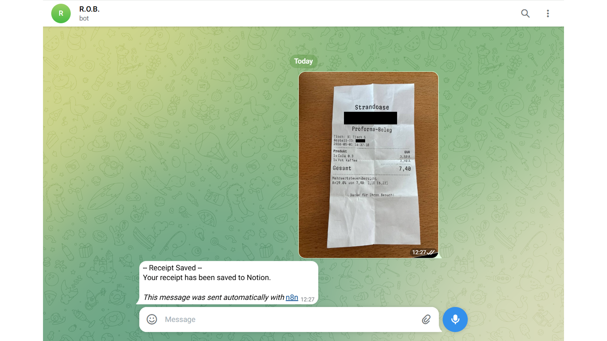
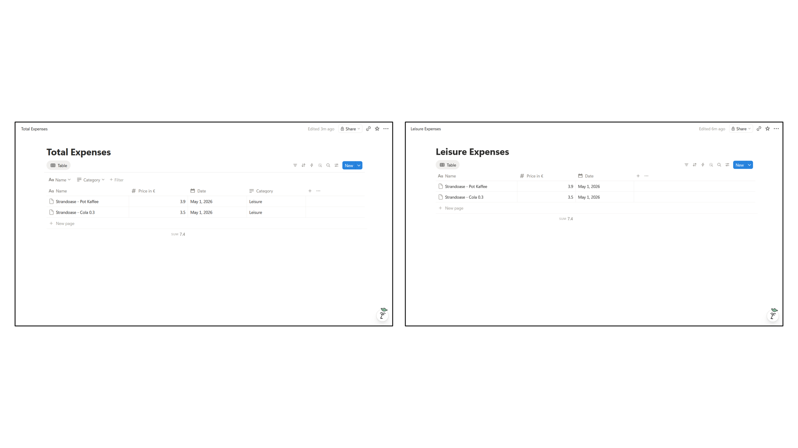
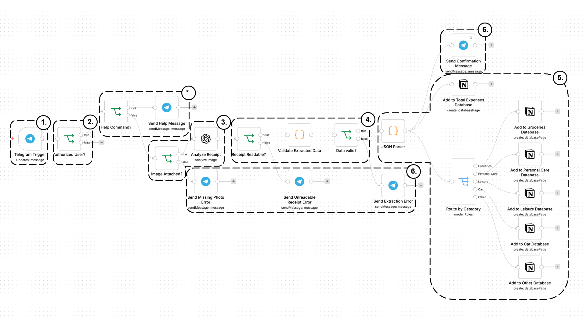

# Receipt2Notion

## Problem
Manual tracking of daily expenses is inconvenient, time-consuming, and error-prone. The goal was to reduce the effort to a single step: taking a photo of a receipt.

## Solution
Built an n8n workflow that:
- receives receipt images via a Telegram bot
- authenticates users via Telegram ID
- extracts structured data (title, price, date, category) using the OpenAI API
- applies rule-based categorization
- stores results in multiple Notion databases (global + category-specific)
- provides user feedback and error handling via Telegram messages

## Example

### Input (Telegram)



The Telegram bot interface ("R.O.B." – Receipt Organization Bot) acts as the user-facing entry point.

### Processing (OpenAI)

The AI extracts a structured JSON array from the receipt image:

```json
[
  {
    "name": "Strandoase - Cola 0.3",
    "price": 3.5,
    "date": "2026-05-01",
    "category": "Leisure"
  },
  {
    "name": "Strandoase - Pot Kaffee",
    "price": 3.9,
    "date": "2026-05-01",
    "category": "Leisure"
  }
]
```

### Output (Notion)



The extracted data is saved to two Notion databases:
- a global expense database
- a category-specific database

## Tech Stack
- n8n
- Telegram Bot API
- Notion API
- OpenAI API
- JavaScript (Code nodes)

## Architecture Overview



The workflow follows an event-driven pipeline:

1. User sends a receipt image via Telegram
2. User is authenticated via Telegram ID
3. Image is processed and sent to an AI model for extraction and categorization
4. Extracted data is validated
5. Results are stored in Notion databases
6. User receives confirmation or error feedback

\*  Users can also request usage instructions via /help.

## Key Implementation Details
- n8n credentials used for secrets
- Image analysis via the GPT-4.1-mini model
- Rule-based categorization into five categories: Groceries, Personal Care, Leisure, Car, and Other
- User authentication via Telegram ID

## Security
The production workflow JSON is not included because n8n exports may contain credential metadata or sensitive headers. Architecture documentation is provided instead.

## Outcome
- Reduced manual expense tracking to a single user action
- Automated data extraction and categorization
